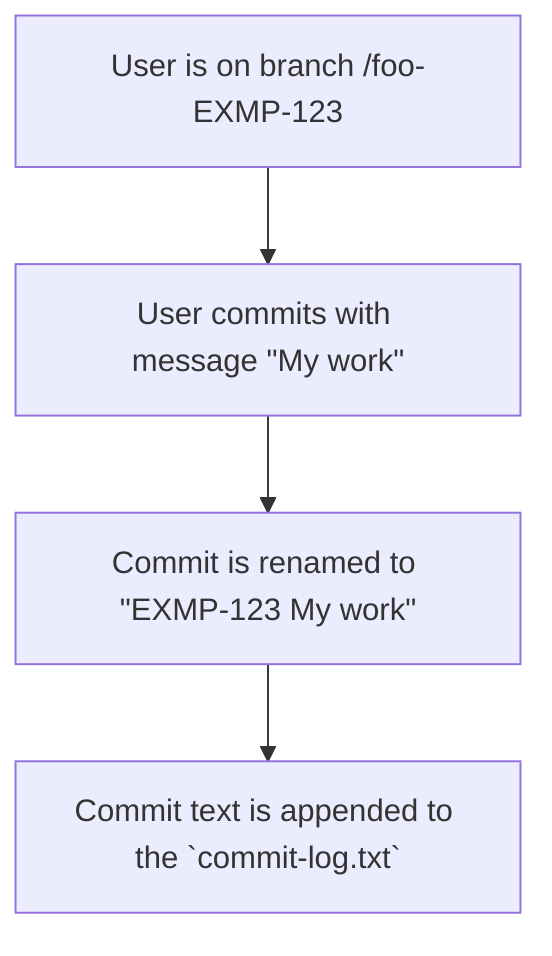
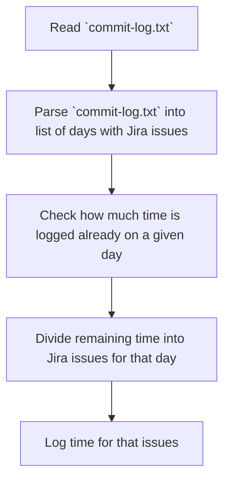

# Jira time logger

Automate your time logging by utilizing Git hooks and Jira API.

## Prerequisites & setup

1. Assuming you work on feature branches please create them in format `(feature|fix|path|...)/EXAMPLE-123-some-desc`.
2. Install and use `commit-msg` Git hook from https://github.com/pbetkier/add-issue-id-hook to add Jira issue to every commit on a branch.
3. Collect all commits from all the repositories in one text file (`commit-log.txt`) using the following `post-commit` Git hook: https://gist.github.com/lmullen/6095650
4. Run `Jira time logger` periodically to read `commit-log.txt` from previous point and update worklogs using Jira API.

### How issues are collected

### How Jira time logger works

### Tips & tricks

#### Configure Git Template

To have Git hooks in every repository you work with make use of git templates: https://coderwall.com/p/jp7d5q/create-a-global-git-commit-hook
